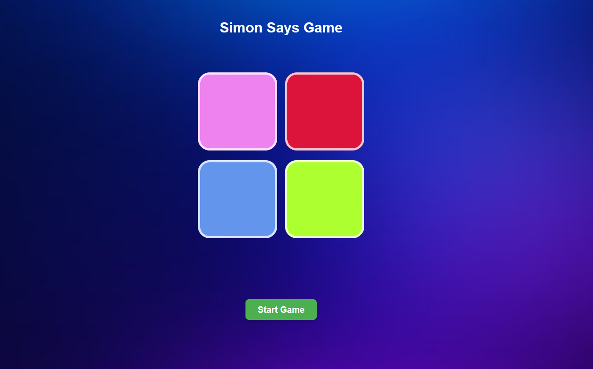

# Simon Says Game 🎮

A simple browser-based memory game where players need to repeat a sequence of colors.  
Each level adds a new step to the sequence, challenging your memory skills!

## 🕹️ How to Play
1. Click the **Start** button.
2. Watch the sequence of colors carefully.
3. Repeat the sequence by clicking the colored buttons in the correct order.
4. If you get the sequence correct, you move to the next level.
5. Game over if you make a mistake — your score is displayed.

## 🎨 Features
- Color based sequence memory game
- Level tracking
- Mobile and desktop friendly
- Simple, responsive design

